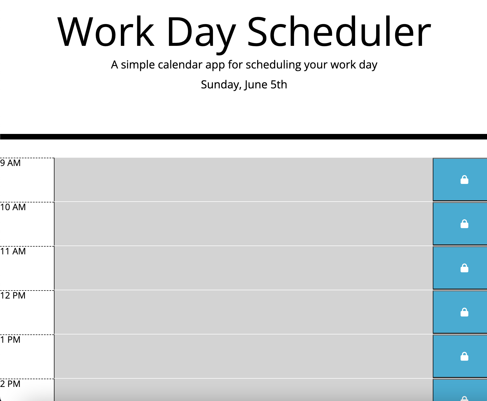

# Workday-Calender

## Description 

This a workday calender which allows it to be able to have tasks entered and to make your day more planned out. Also has a color seperator which helps color cordinate each category. If its currently needing to be done it will be gray, if its currently needs to be done it will be red, and if its coming soon it will be displayed in green. 

## Languages Used 
- JavaScript
- Html
- Css

## Frameworks and tools used
- Jquery
- Bootstrap
- fontAwesome
- moment.js

## View Here
[Deployed page](https://graydevon.github.io/Workday-Calender/)

